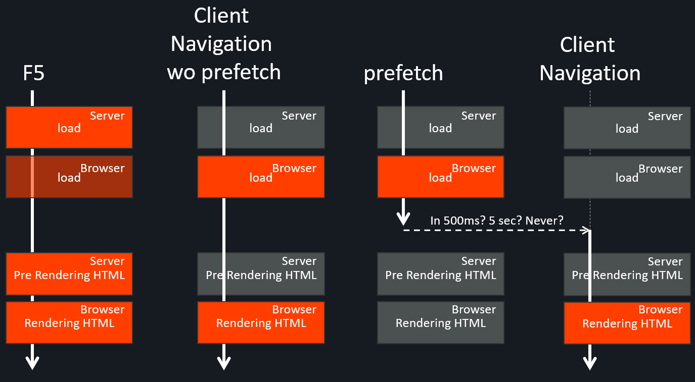

# Playing around with prefetch - load - client side navigation

Best is maybe to go to [/src/routes/user-[userId].svelte](/src/routes/user-[userId].svelte)

## This is what I have in mind when speaking about load, fetch, prefetch, ...

I'm correct? 🤔

## Options to consider?

### 1/ event.isInCSRMode

https://github.com/sveltejs/kit/issues/4447?

### 2/ event.isPrefetch

### 3/ $navigating.isPrefetch
